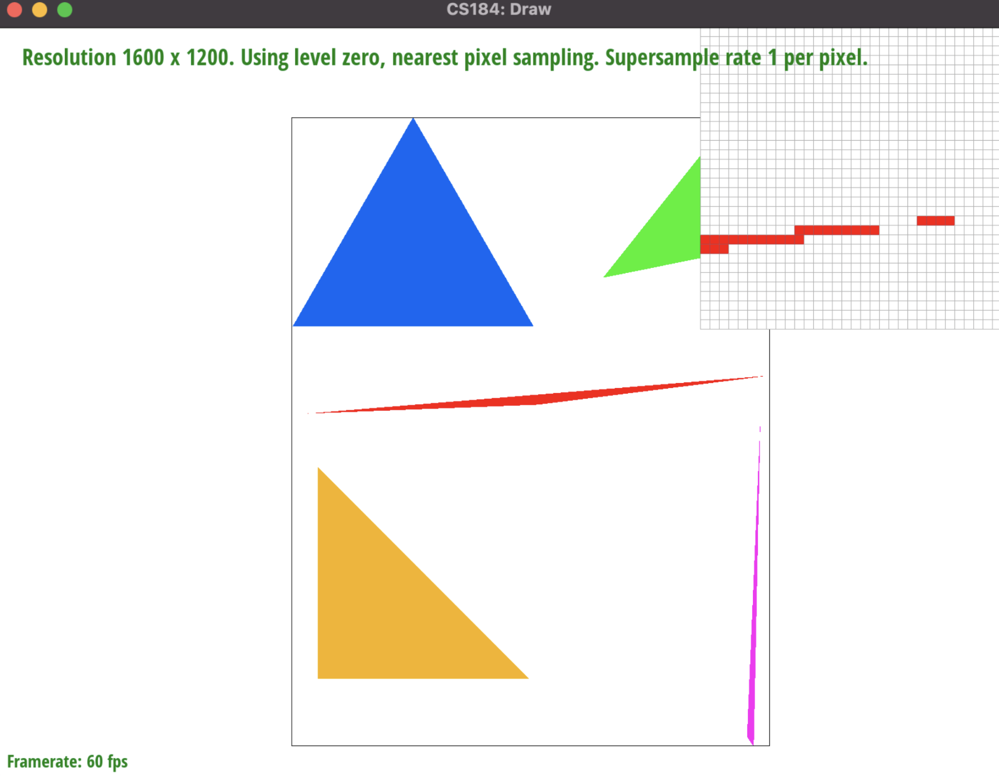
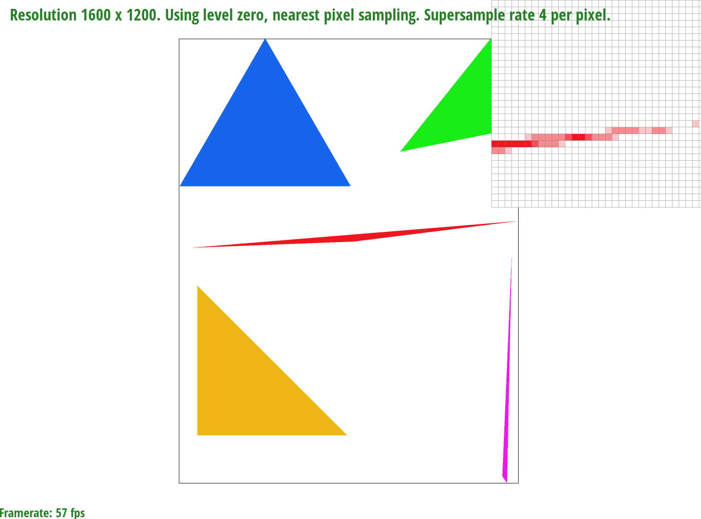
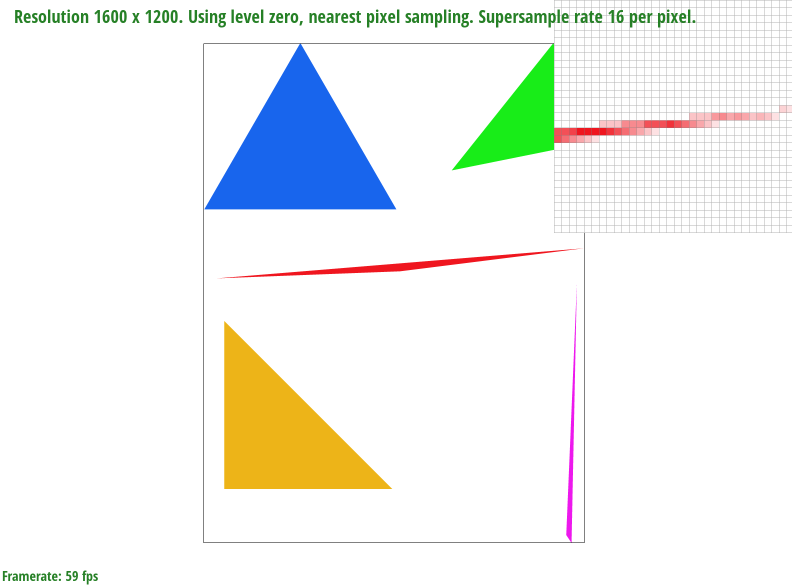
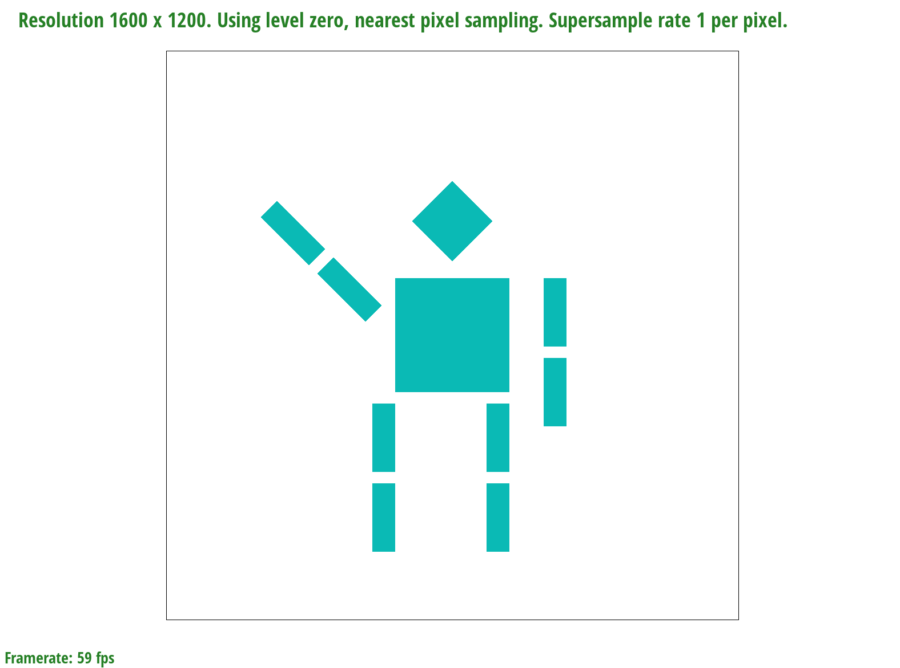
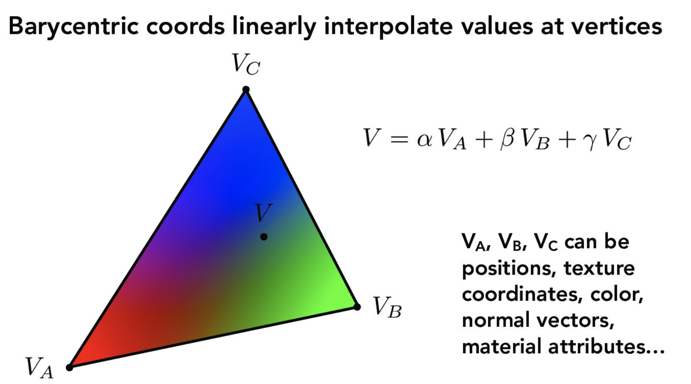
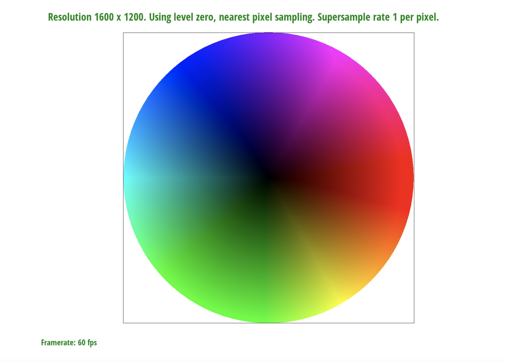
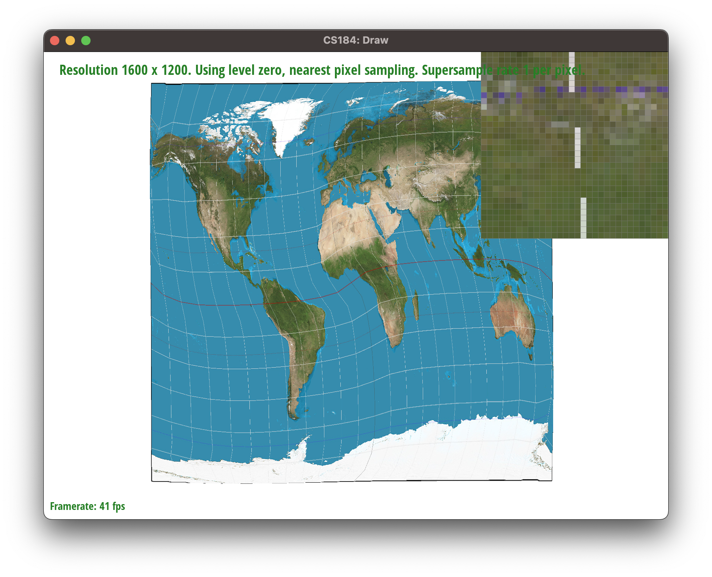
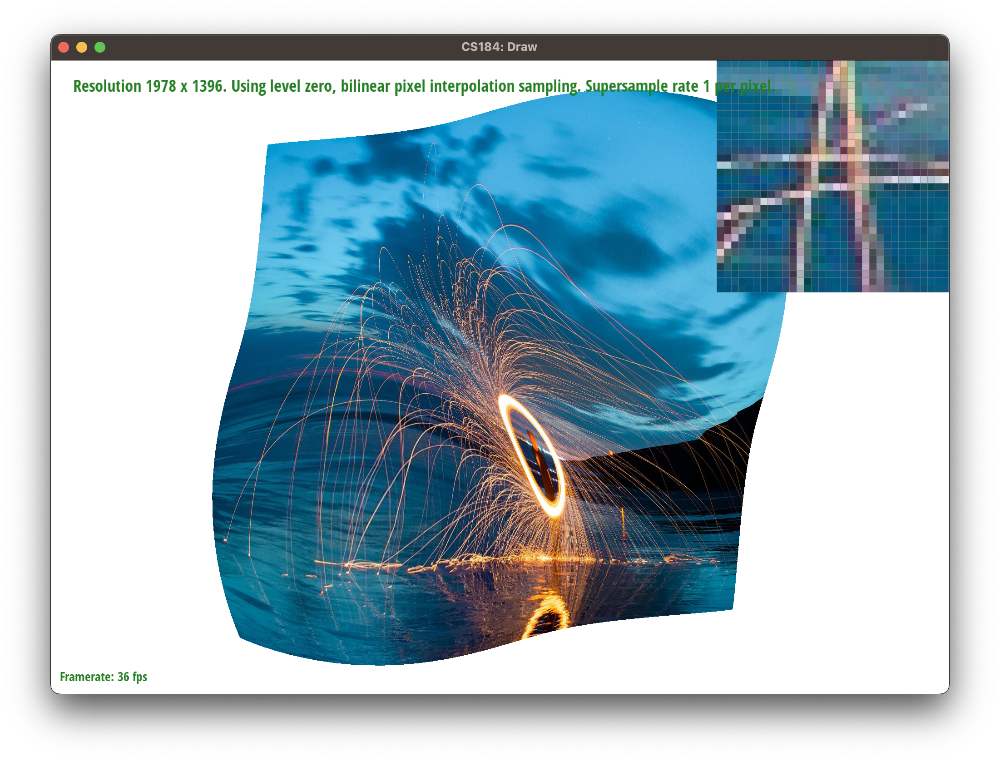

<h1 align="middle">CS 184: Computer Graphics and Imaging</h1>
<h2 align="middle">Project 1: Rasterizer</h1>
<h3 align="middle">Michael Lin, Rachel Lee</h2>

## Overview
Throughout this project, we implemented a few functionalities that are key to today's computer graphics world. We started off exploring the way shapes are drawn onto the screen, and the optimizations that can be done to speed up the process. We then implemented supersampling - a method for softening jaggies along the edge. Finally, we learned how to apply textures onto these shapes, and how antialiasing can be done for the textures as well.

 ***

### Task 1: Drawing Single-Color Triangles

**Walk through how you rasterize triangles in your own words.**

We first find the smallest possible bounding box of the triangle using the three provided vertices and find the minimum and maximum points of the bounding box. Then, we iterate through each sample pixel within the bounding box and use the point-in-triangle test to check if the sample point is within the triangle. If at any instance the sample point fails the three line tests, then we break from the loop and check again from the next column.

**Explain how your algorithm is no worse than one that checks each sample within the bounding box of the triangle.**

Since the algorithm iterates through the x and y values of the bounding box maximum, this ensures that in the worst possible case that the maximum possible iterations in the double for-loop is O(xy) which is the area of the bounding box of the triangle. The bounding box of the triangle is also dependent on the maximum largest possible x and y value of the triangle, so the maximum possible number of sample points checked is within the bounding box.

**Show a png screenshot of basic/test4.svg with the default viewing parameters and with the pixel inspector centered on an interesting part of the scene.**



**Extra credit: Explain any special optimizations you did beyond simple bounding box triangle rasterization, with a timing comparison table (we suggest using the c++ clock() function around the svg.draw() command in DrawRend::redraw() to compare millisecond timings with your various optimizations off and on).**

To optimize the filling of the pixels while iterating through each sample point in each column of the bounding box, we break from the inner for loop if at any point there is a sample point that fails the point-in-triangle test. This allows for a noticeable improvement in runtime as we reduce wasteful computation of the vector cross products and can move on to the next column in the outer loop quickly.

| Before optimization | After optimization |
| ----------- | ----------- |
| 0.00105 seconds | 0.000843 seconds |
| 0.001273 seconds | 0.000792 seconds |
| 0.00109 seconds | 0.000884 seconds |
| 0.001151 seconds | 0.000791 seconds |

### Task 2: Antialiasing by Supersampling

**Walk through your supersampling algorithm and data structures. Why is supersampling useful? What modifications did you make to the rasterization pipeline in the process? Explain how you used supersampling to antialias your triangles.**

To account for supersampling in our existing rasterization implementation, we scaled the vertices of the triangle by a step size value of ``` sqrt(sample_rate) ``` where ```sample_rate``` is a variable of the ```Rasterizer``` class. This results in a scaled bounding box of the same factor which allows the algorithm to traverse more pixels during each iteration of the double for-loops. Then, in ```fill_sample_pixel``` we set the pixel at ```sample_buffer[y * width * step_size + x]```  to the provided color which results in a more distributed average coloring of each triangle.

Supersampling is especially useful for creating a blurred effect for sharper corners and shapes, instead of the existing rough jagged lines. Since pixel values take on averaged color values instead of just a full color, this creates an antialiasing effect with the sampled points and helps blur the jagged lines.

**Show png screenshots of basic/test4.svg with the default viewing parameters and sample rates 1, 4, and 16 to compare them side-by-side. Position the pixel inspector over an area that showcases the effect dramatically; for example, a very skinny triangle corner. Explain why these results are observed.**

<div align="middle">
  <table style="width=100%">
    <tr>
      <td>
        
        <figcaption align="middle">Sample rate 1</figcaption>
      </td>
      <td>
        
        <figcaption align="middle">Sample rate 3</figcaption>
      </td>
    </tr>
    <br>
    <tr>
      <td>
        
        <figcaption align="middle">Sample rate 9</figcaption>
      </td>
      <td>
        
        <figcaption align="middle">Sample rate 16</figcaption>
      </td>
    </tr>
  </table>
</div>

With a sample rate of 1, this does not affect the sampled points or bounding box so the pixels are either fully filled or left empty, which results in the jagged lines and stray pixels in the triangle corners. However, as the sample rate increases to 4, 9, and 16, we see that the pixels are gradually filled with more intermediate values for the colors resulting in the smoother, blurred lines effect. 

### Task 3: Transforms
**Create an updated version of svg/transforms/robot.svg with cubeman doing something more interesting, like waving or running. Feel free to change his colors or proportions to suit your creativity. Save your svg file as my_robot.svg in your docs/ directory and show a png screenshot of your rendered drawing in your write-up. Explain what you were trying to do with cubeman in words.**



We changed the hex color of the cubeman to a nice color (Tiffany Blue) and rotated its arms so that it looks like it is waving. We rotated the left arm by 45 degrees and the right arm by 90 degrees. We then translated the right arm in the y direction by -20 so that it aligns with the shoulder of the cubeman.

### Task 4: Barycentric coordinates

**Explain barycentric coordinates in your own words and use an image to aid you in your explanation. One idea is to use a svg file that plots a single triangle with one red, one green, and one blue vertex, which should produce a smoothly blended color triangle.**



Barycentric coordinates are useful in linear interpolation of triangles and getting smoother varying values within the triangle, and these values can include anything from texture, color, and vector values. Given the three triangle vertices V~A~, V~B~, and V~C~ and a sample coordinate within the triangle, the $\alpha$, $\beta$, and $\gamma$ weights can be calculated. Using these weight values, we multiply each weight with the respective value that we wish to find (in this case the color of the pixel C = $\alpha$ C~A~ + $\beta$ C~B~ + $\gamma$ C~C~).
    
**Show a png screenshot of svg/basic/test7.svg with default viewing parameters and sample rate 1. If you make any additional images with color gradients, include them.** 



### Task 5: "Pixel sampling" for texture mapping

**Explain pixel sampling in your own words and describe how you implemented it to perform texture mapping. Briefly discuss the two different pixel sampling methods, nearest and bilinear.**
  
Pixel sampling is essentially converting discrete pixel information to a continuous 2D-coordinate domain. In texture mapping, for any given point within the triangle in the sample buffer, we will convert its coordinate to the texture domain using the barycentric system. Then we will sample the texture at `(u, v)` using the sampling technique specified.

In the project, we implemented the nearest neighbor and the bilinear sampling method. `P_NEAREST` takes the floating point `(u, v)` and round it to the nearest integer. This effective samples the closest pixel to `(u, v)` and hence the name. `P_LINEAR` on the other hand, takes the weighted average of the four closest pixel value, namely `(floor(u), floor(v))`, `(floor(u), ceil(v))`, `(ceil(u), floor(v))`, `(ceil(u), ceil(v))`.

**Check out the svg files in the `svg/texmap/` directory. Use the pixel inspector to find a good example of where bilinear sampling clearly defeats nearest sampling. Show and compare four png screenshots using nearest sampling at 1 sample per pixel, nearest sampling at 16 samples per pixel, bilinear sampling at 1 sample per pixel, and bilinear sampling at 16 samples per pixel.**

<div align="middle">
  <table style="width=100%">
    <tr>
      <td>
        
        <figcaption align="middle">Nearest 1</figcaption>
      </td>
      <td>
        
        <figcaption align="middle">Bilinear 1</figcaption>
      </td>
    </tr>
    <br>
    <tr>
      <td>
        
        <figcaption align="middle">Nearest 16</figcaption>
      </td>
      <td>
        
        <figcaption align="middle">Bilinear 16</figcaption>
      </td>
    </tr>
  </table>
</div>

**Comment on the relative differences. Discuss when there will be a large difference between the two methods and why.**

In the example above, the bilinear method produces less jaggies than the nearest neighbor. This effect will be especially prominent if the area in the texture has high frequency signals. In this case, the thin white line is the high frequency signal.

### Task 6: "Level sampling" with mipmaps for texture mapping

**Explain level sampling in your own words and describe how you implemented it for texture mapping.**

Level sampling works by combine differently filter texture profile into a single structure. This is because different regions on screen will have different footprint on the texture, if we indiscriminately apply a low pass filter in an attempt to get rid of the jaggies, area will low frequencies to begin with will appear over-blurred.

To implement level sampling, we will first generate and store the levels in the `Texture` class. We will compute which level or levels to use based on the level sampling policy. For this project, we have `L_ZERO`, `L_NEAREST`, and `L_LINEAR`. `L_ZERO` will simply uses the full resolution will applying the texture. `L_NEAREST` will select the closest integer level using the formula:
$$L = \max \Big( \sqrt{\big(\frac{du}{dx}\big)^2 + \big(\frac{dv}{dx}\big)^2},  \sqrt{\big(\frac{du}{dy}\big)^2 + \big(\frac{dv}{dy}\big)^2} \Big)$$ and 
$$D = \log_2 L$$

So essentially,

$$\texttt{L\_NEAREST} = \texttt{round}(D)$$

`L_LINEAR` works similarly to `L_NEAREST`, but instead of selecting a integer level, it linearly interpolate the two closest levels.  This allows us to mix two levels together and produces better antialiased result.

**You can now adjust your sampling technique by selecting pixel sampling, level sampling, or the number of samples per pixel. Describe the tradeoffs between speed, memory usage, and antialiasing power between the three various techniques.**

Among the three, supersampling has the greatest impact on performance. Since every pixel needs to be sampled multiple times on each draw command, drawing time will increase significantly.

Level sampling mitigates that by sacrificing space. It pre-computes different sampling level so that we don't need to do it on the fly. Doing so require us to save the MIP levels, thereby increasing the memory footprint.

Finally, bilinear pixel sampling is the fastest of them all, and has similar memory usage compared the default nearest neighbor method, but the antialiasing performance isn't as great as the other two method.

**Using a png file you find yourself, show us four versions of the image, using the combinations of `L_ZERO` and `P_NEAREST`, `L_ZERO` and `P_LINEAR`, `L_NEAREST` and `P_NEAREST`, as well as `L_NEAREST` and `P_LINEAR`.**

<div align="middle">
  <table style="width=100%">
    <tr>
      <td>
        
        <figcaption align="middle">L_ZERO + P_NEAREST</figcaption>
      </td>
      <td>
        
        <figcaption align="middle">L_ZERO + P_LINEAR</figcaption>
      </td>
    </tr>
    <br>
    <tr>
      <td>
        
        <figcaption align="middle">L_NEAREST + P_NEAREST</figcaption>
      </td>
      <td>
        
        <figcaption align="middle">L_NEAREST + P_LINEAR</figcaption>
      </td>
    </tr>
  </table>
</div>
